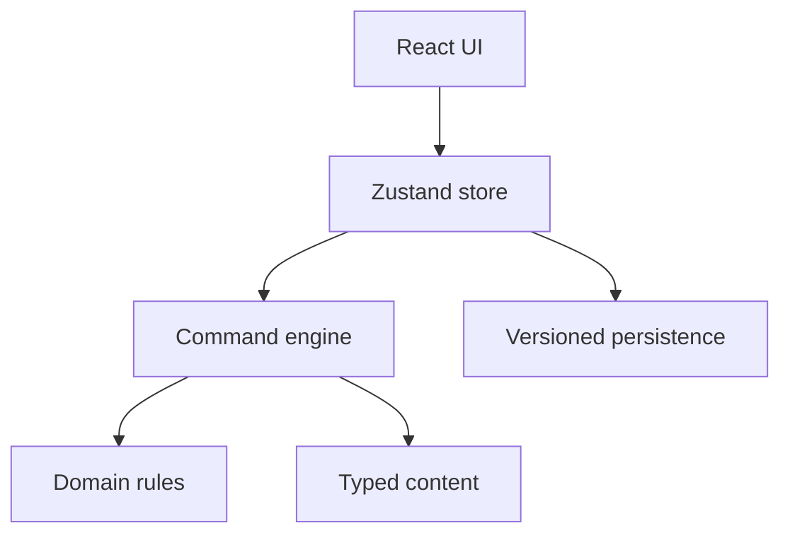

# Архитектура «Выход из круга»

Новая версия не использует код legacy-игры. Старые файлы сохранены в `legacy/` только как справочник механик и контента.

## Граница модулей

- `game/domain` - типы состояния, команд и событий.
- `game/engine` - единственная точка изменения игрового состояния.
- `game/systems` - чистые финансовые расчёты.
- `game/content` - профессии, поле, бизнесы и события.
- `game/persistence` - проверка и миграция сохранений.
- `store` - связывает движок, сохранение и интерфейс.
- `ui` - экраны и компоненты без экономической логики.

## Игровой цикл MVP

1. Игрок выбирает профессию и запускает партию с двумя ботами.
2. В фазе `ready` можно бросить кубик.
3. Движок перемещает игрока и создаёт обязательное решение клетки.
4. После решения выполняются ходы ботов.
5. Каждый завершённый ход игрока продвигает календарь на 4-5 дней; количество ботов на скорость календаря не влияет.
6. После семи ходов проходят 30 игровых дней и начисляется месячный денежный поток.
7. Победа наступает, когда пассивный доход игрока покрывает все расходы.

## Инварианты

- Деньги, активы и фаза меняются только командой движка.
- Команда проверяется относительно текущей фазы.
- Покупка не может создать отрицательный остаток денег.
- Кредит и доля меняют цену входа и будущий поток до создания актива.
- Один ход можно завершить только один раз.
- Сохранение имеет версию и валидируется перед загрузкой.
- Случайность поступает в движок через seed и воспроизводима в тестах.

## Следующие модули после MVP

Ипотека и залоги, сложные переговоры, перепродажа, развитие бизнеса, уровни навыков, расширенные стратегии ботов и балансировочный симулятор добавляются поверх командного движка без изменения UI-контракта.
